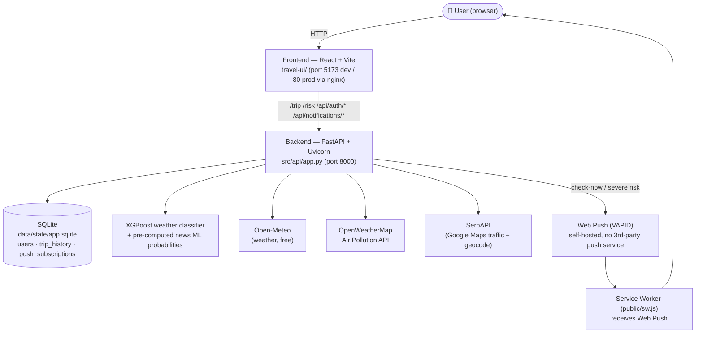

# Vietnam Travel Risk AI — Full Documentation

[](https://github.com/YOUR-USERNAME/YOUR-REPO/actions/workflows/ci.yml)

## 🌐 Live Demo

**👉 [Try the app now →](https://travel-ui-hazel.vercel.app)** (powered by Vercel + Railway)

- **Register** with any email (e.g., `demo@example.com`)
- **Get GPS** to see risk around your location
- **Check Trip** to Đà Lạt, Hạ Long, etc. — see real-time weather AI, traffic, and risk scores
- **Enable Push Alerts** for destinations you're interested in

---

> **Lean-Agile Workshop — Final Project Submission**
>
> An end-to-end travel risk assessment system for Vietnam, combining a trained XGBoost weather classifier, a trained Vietnamese news classifier with keyword-based severity rules, live traffic data, user accounts, Web Push alerts, and a React + Leaflet map. PhoBERT training and inference are available as an optional higher-capacity news model when a checkpoint is supplied.
>
> *(Badge above becomes live once this repo is pushed to GitHub — replace `YOUR-USERNAME/YOUR-REPO` with the actual path.)*

---

## Table of Contents

1. [Project Overview](#1-project-overview)
2. [System Architecture](#2-system-architecture)
3. [Prerequisites](#3-prerequisites)
4. [Quick Start (Docker)](#4-quick-start-docker)
5. [Manual Dev Setup — Step by Step](#5-manual-dev-setup--step-by-step)
6. [Environment Variables](#6-environment-variables)
7. [Running the Application](#7-running-the-application)
8. [Verifying the System Works](#8-verifying-the-system-works)
9. [API Reference](#9-api-reference)
10. [Data Pipeline Documentation](#10-data-pipeline-documentation)
11. [AI / ML Model Documentation](#11-ai--ml-model-documentation)
12. [Frontend Documentation](#12-frontend-documentation)
13. [Caching Architecture](#13-caching-architecture)
14. [Testing & CI](#14-testing--ci)
15. [Deployment](#15-deployment)
16. [Project Structure](#16-project-structure)
17. [Design Decisions & Logs](#17-design-decisions--logs)
18. [Known Issues & Future Work](#18-known-issues--future-work)
19. [Troubleshooting](#19-troubleshooting)
20. [Screenshots](#20-screenshots)

---

## 1. Project Overview

### What it does

This system helps travelers in Vietnam assess travel risk by combining **three independent data sources**:

| Source | Method | What it tells you |
|--------|--------|-------------------|
| **Weather AI** | XGBoost classifier + hard safety rules on Open-Meteo weather and live PM2.5 | Are current or forecast weather conditions dangerous? |
| **News Risk** | Offline TF-IDF/logistic-regression risk probability (optional PhoBERT override) + keyword severity rules | What incidents appear in the collected news corpus, and how old is that evidence? |
| **Traffic** | SerpAPI live data when configured; TrackAsia/OSRM route estimates otherwise | Is the route congested when live data exists? What are the estimated distance and drive time when a route is available? |

These three signals are combined into a single **recommendation**: ✅ **GO** / ⚠️ **CAUTION** / ❌ **DON'T GO**.

### Key Features

- **One-click trip check** — Single `/trip` API call returns traffic + weather AI + news risk + recommendation
- **7-day weather forecast** — AI predicts risk for each day, highlights best/worst travel days
- **Trip purpose adjustment** — Risk scores adapt based on trip type (dating, family, adventure, solo)
- **Interactive map** — 63 province markers, route polyline, risk heatmap, weather popup
- **Multi-city comparison** — Compare weather risk across up to 10 cities simultaneously
- **Province risk trends** — Historical risk trends from news article analysis
- **7-layer in-memory caching** — Minimizes external API calls, sub-second responses after first load
- **Accounts & trip history** — Email/password JWT auth (SQLite-backed); every trip check while logged in is saved and browsable
- **Air quality** — PM2.5 uses OpenWeatherMap when configured, then Open-Meteo Air Quality; a fixed value is used only if both calls fail
- **Severe-weather push alerts** — Self-hosted Web Push (VAPID) notifies you when a watched destination's risk turns severe
- **One-command local run** — `docker compose up --build` starts backend + frontend together
- **CI on every push** — GitHub Actions runs the full pytest suite + frontend build

---

## 2. System Architecture



| Layer | Tech | Notes |
|-------|------|-------|
| Frontend | React 19 + Vite 7 + Leaflet | Dev: Vite proxy → :8000. Prod (Docker): nginx reverse-proxies the same paths to the `backend` service. |
| Backend | FastAPI + Uvicorn | `src/api/app.py` — endpoints only; logic in `config.py`, `utils.py`, `routes.py`, `weather_ai.py`, `auth.py`, `db.py`, `notifications.py`. |
| Auth | PyJWT + bcrypt | Email/password, no OAuth/external identity provider. |
| Storage | SQLite (raw `sqlite3`, no ORM) | `data/state/app.sqlite` — users, trip_history, push_subscriptions. |
| ML | XGBoost (weather) + TF-IDF/logistic regression (news); optional PhoBERT output | News probabilities are computed offline and joined by article ID when the API loads features. |
| External APIs | Open-Meteo (free), OpenWeatherMap Air Pollution, SerpAPI, TrackAsia/OSRM | All keys read from `.env` — see [§6](#6-environment-variables). |
| Push | pywebpush + browser Service Worker | Self-hosted VAPID keypair, no external push provider account. |

---

## 3. Prerequisites

| Requirement | Version | Notes |
|-------------|---------|-------|
| **Python** | 3.11.x | Tested on 3.11.0. Other 3.11.x versions should work. |
| **Node.js** | >= 18 | For the React frontend. Tested with Node 18/20. |
| **npm** | >= 9 | Comes with Node.js. |
| **OS** | Windows 10/11 | All commands below are PowerShell. macOS/Linux users: substitute `.\venv\Scripts\Activate.ps1` with `source venv/bin/activate`. |
| **Git** | Any | To clone the repository (if applicable). |
| **VS Code** | Recommended | With Python and ESLint extensions. |
| **SerpAPI Key** | Optional for live traffic and detailed place search | Without it, city search uses Open-Meteo; driving routes try TrackAsia, then OSRM. Live congestion is marked unavailable. |

### Hardware

- **RAM**: Minimum 4 GB free (model loading + DataFrame)
- **Disk**: ~500 MB for dependencies + model files
- **GPU**: Not required to run the API or train the included TF-IDF and XGBoost models. PhoBERT fine-tuning is much faster on a GPU.

---

## 4. Quick Start (Docker)

The fastest way to run the full stack (backend + frontend) locally:

```powershell
# 1. Copy the env template; add SERPAPI_KEYS if live traffic is needed (see §6)
Copy-Item .env.example .env

# 2. Build and start both services
docker compose up --build
```

- Backend: http://localhost:8000 (health check: http://localhost:8000/health)
- Frontend: http://localhost:5173

`docker-compose.yml` mounts `./data` into the backend container so the SQLite database and pre-processed features persist across restarts. `Dockerfile` builds the API (Python 3.11-slim), `travel-ui/Dockerfile` builds the frontend (Node 20 → nginx, which reverse-proxies API paths to the backend container — see `travel-ui/nginx.conf`).

Requires [Docker Desktop](https://www.docker.com/products/docker-desktop/) running. For local development without Docker (hot reload, debugging), use the manual setup below.

---

## 5. Manual Dev Setup — Step by Step

> **Goal**: From a fresh zip/clone to a fully running system in ~5 minutes.

### Step 1: Extract and Open in VS Code

```powershell
# If you received a zip file:
Expand-Archive -Path .\travel_risk_pipeline_skeleton.zip -DestinationPath .\project
cd .\project\travel_risk_pipeline_skeleton

# Open in VS Code
code .
```

### Step 2: Verify Critical Files Exist

Run these checks in the VS Code terminal (**Terminal → New Terminal**, or ``Ctrl+` ``):

```powershell
# These files MUST exist for the system to work:
Test-Path .\requirements.txt                                          # Python deps
Test-Path .\travel-ui\package.json                                    # Frontend deps
Test-Path .\src\integrations\weather\weather_risk_v5_classifier.pkl   # Active weather AI model
Test-Path .\src\integrations\weather\model_features.json              # Model feature names
Test-Path .\data\features\articles_features.jsonl                     # Pre-processed news data
Test-Path .\configs\provinces.yaml                                    # 63 provinces + coords
```

All should return `True`. If the model file (`.pkl`) or features data (`.jsonl`) is missing, download them from the shared drive link (if provided separately) and place them at the exact paths shown above.

### Step 3: Create Python Virtual Environment

```powershell
# From the project root directory
python -m venv venv
.\venv\Scripts\Activate.ps1
```

You should see `(venv)` prefix in your terminal prompt.

> **Note**: If `Activate.ps1` fails with an execution policy error, run this first:
> ```powershell
> Set-ExecutionPolicy -ExecutionPolicy RemoteSigned -Scope CurrentUser
> ```

### Step 4: Install Python Dependencies

```powershell
pip install -r requirements.txt
```

This installs: FastAPI, uvicorn, pandas, numpy, scikit-learn, xgboost, joblib, PyYAML, requests, torch, transformers, and other dependencies. Full install takes ~2–5 minutes depending on internet speed.

**Verify installation**:
```powershell
python -c "import fastapi; import xgboost; import pandas; import joblib; print('All core packages OK')"
```

### Step 5: Configure SerpAPI Key

Open `src/integrations/traffic/config.py` and replace the key(s) in the `SERPAPI_KEY` list with your own:

```python
SERPAPI_KEY = [
    "your_serpapi_key_here",
]
```

Get a free key at [serpapi.com](https://serpapi.com) (100 searches/month on free tier).

> **Without a SerpAPI key**: `/trip` and `/traffic/route` support city and province lookups using Open-Meteo and the local province map. TrackAsia supplies a driving route and estimated travel time when available; OSRM is the next fallback. If both routing services fail, the trip assessment still returns weather and news with route distance/time marked unavailable and a caution. Live congestion and delay remain unavailable; specific businesses and street addresses may still need SerpAPI.

### Step 6: Install Frontend Dependencies

```powershell
cd travel-ui
npm install
cd ..
```

### Step 7: Final Verification

```powershell
# Check model loads correctly
python -c "import joblib; m = joblib.load('src/integrations/weather/weather_risk_v5_classifier.pkl'); print('Model loaded OK, type:', type(m))"

# Check features data exists and has content
python -c "lines = open('data/features/articles_features.jsonl', encoding='utf-8').readlines(); print(f'Features file: {len(lines)} articles loaded')"
```

Both commands should succeed without errors.

---

## 6. Environment Variables

All secrets/config are read from a `.env` file at the repo root (loaded via `python-dotenv` in `src/api/config.py`). Copy `.env.example` → `.env` and fill in what you need — every value has a safe fallback so the app still boots without any of them (some features just stay disabled/degraded).

| Variable | Required for | Where to get it | Fallback if unset |
|----------|--------------|------------------|--------------------|
| `SERPAPI_KEYS` | `/trip`, `/traffic/route` (live traffic + detailed place search) | Free tier at [serpapi.com](https://serpapi.com) | City/province lookup and estimated TrackAsia/OSRM route are used; live traffic is unavailable |
| `TRACKASIA_KEY` | Estimated driving route and polyline fallback | Optional — configure your own key in `.env` | Falls back to OSRM; missing route data is reported if both fail |
| `JWT_SECRET` | Auth token signing | Any long random string you generate | Insecure dev default — **must** be changed before deploying publicly |
| `JWT_EXPIRE_MINUTES` | Auth token lifetime | — | `1440` (24h) |
| `OPENWEATHERMAP_API_KEY` | Preferred PM2.5 source | OpenWeatherMap Air Pollution API | Open-Meteo Air Quality, then fixed value (10.0) if unavailable |
| `NEWS_PREDICTIONS_PATH` | Override the default news prediction artifact | Local JSONL path | Baseline predictions, then PhoBERT predictions when present |
| `NEWS_RISK_MAX_AGE_DAYS` | Maximum age of news used as current trip risk | Number of days | 30 |
| `VAPID_PUBLIC_KEY` / `VAPID_PRIVATE_KEY` | Web Push severe-weather alerts | Run `python scripts/generate_vapid_keys.py` and paste the output | Push endpoints return 503 (feature disabled) |
| `VAPID_CONTACT_EMAIL` | Web Push (VAPID claim) | Any `mailto:` address | `mailto:admin@example.com` |

For tests, `DB_PATH_OVERRIDE` lets the test suite point the SQLite database at a throwaway temp file (`tests/conftest.py` sets this automatically — you shouldn't need to touch it).

---

## 7. Running the Application

You need **two terminals** running simultaneously: one for the backend, one for the frontend.

### Terminal 1 — Backend (FastAPI)

```powershell
# From project root
.\venv\Scripts\Activate.ps1
uvicorn src.api.app:app --reload --port 8000
```

**Expected startup output**:
```
[Weather AI] Loaded 15 feature names: ['location_encoded', 'temperature', ...]
[Weather AI] Model loaded successfully.
[Startup] Features DataFrame pre-loaded: XXXX rows
INFO:     Uvicorn running on http://127.0.0.1:8000
```

Quick check: open http://127.0.0.1:8000/health in your browser → should return `{"ok": true}`.

### Terminal 2 — Frontend (Vite)

```powershell
cd travel-ui
npm run dev
```

**Expected output**:
```
VITE vX.X.X  ready in XXXms

➜  Local:   http://localhost:5173/
```

Open **http://localhost:5173** in your browser to see the application.

### Summary

| Component | Command | URL |
|-----------|---------|-----|
| Backend | `uvicorn src.api.app:app --reload --port 8000` | http://127.0.0.1:8000 |
| Frontend | `cd travel-ui && npm run dev` | http://localhost:5173 |

---

## 8. Verifying the System Works

After both servers are running, perform these verification steps to confirm full reproducibility.

### 6.1 Backend Health Check

```powershell
Invoke-RestMethod http://127.0.0.1:8000/health
# Expected: @{ok=True}
```

### 6.2 Debug — Verify Paths and Config

```powershell
Invoke-RestMethod http://127.0.0.1:8000/debug/where
# Verify: features_exists=True, provinces_exists=True
```

### 6.3 Debug — Verify Data is Loaded

```powershell
Invoke-RestMethod http://127.0.0.1:8000/debug/stats
# Expected: rows > 0, columns list, province_top showing Vietnamese provinces
```

### 6.4 Weather AI — Offline Predict (no internet needed)

```powershell
$body = '{"province":"Đà Nẵng","temperature":28,"humidity":85,"precipitation":50,"wind":30,"pm25":15,"visibility_km":5,"uv_index":7}'
Invoke-RestMethod -Method Post -Uri http://127.0.0.1:8000/weather/ai -ContentType 'application/json' -Body $body
# Expected: risk_level, risk_score, message, detection_method="AI_XGBOOST"
```

### 6.5 Weather AI — Live Weather (Open-Meteo, free, no key)

```powershell
$body = '{"city":"Hanoi"}'
Invoke-RestMethod -Method Post -Uri http://127.0.0.1:8000/weather/ai/live -ContentType 'application/json' -Body $body
# Expected: city_resolved, coordinates, risk_level, risk_score, weather_provider="Open-Meteo"
```

### 6.6 Province Risk from News

```powershell
Invoke-RestMethod "http://127.0.0.1:8000/risk?place=%C4%90%C3%A0%20N%E1%BA%B5ng"
# Expected: overall_risk_score (0-10), num_articles, risk_assessment breakdown
```

### 6.7 Seven-Day Forecast

```powershell
Invoke-RestMethod "http://127.0.0.1:8000/weather/ai/forecast?city=Da+Nang&days=7"
# Expected: daily array with 7 entries, each with date, risk_level, risk_score, temperature
```

### 6.8 Trip Check (SerpAPI optional for live traffic)

```powershell
Invoke-RestMethod "http://127.0.0.1:8000/trip?destination=Da+Lat&lat=10.77&lon=106.69"
# Expected: from, to, traffic, risk, weather, recommendation, matched_province
```

### 6.9 Frontend Walkthrough

1. Open **http://localhost:5173** in Chrome/Edge
2. Click **"📡 Lấy GPS"** → Allow browser location access
3. Type **"Đà Lạt"** in the Destination field
4. Click **"Check Trip"** → Observe:
   - Route drawn on map (blue polyline)
   - Weather popup appears on map (top-right, glass card)
   - Trip results appear in left panel (traffic status, distance, recommendation)
   - 7-day forecast strip loads below the input
5. Click any **blue province marker** on the map → Bottom panel slides up with risk breakdown + trend chart
6. If trip destination matches a province, a **"🔍 Rủi ro tại [province]"** button appears next to the trip purpose badge → Click it to view that province's risk panel

### 6.10 Automated Test Script

```powershell
.\venv\Scripts\Activate.ps1
python scripts/test_openmeteo_weather.py
```

This script runs 5 automated tests against the running backend: health check, offline predict, live weather, multi-city live, and forecast.

---

## 9. API Reference

### Core Endpoints

| Method | Path | Description | External API |
|--------|------|-------------|--------------|
| `GET` | `/health` | Health check | None |
| `GET` | `/risk?place={province}` | Risk score for one province (from news) | None |
| `GET` | `/risk/events?place={province}&limit=12` | Dated source articles whose headlines explicitly mention a risk and the selected place | None |
| `GET` | `/risk/compare?places={csv}` | Compare risk for multiple provinces (max 20) | None |
| `GET` | `/risk/trend?place={province}` | Risk trend over time | None |
| `GET` | `/trip?destination={name}&lat={lat}&lon={lon}&trip_purpose={purpose}` | **Full trip check** — route + weather + risk + recommendation; live traffic when SerpAPI is configured | SerpAPI optional |
| `GET` | `/traffic/route?from_addr={a}&to_addr={b}` | Driving route between places; live traffic when available | SerpAPI optional |
| `GET` | `/map/points` | Province list with coordinates (for map markers) | None |
| `GET` | `/map/heat` | Heatmap data (risk intensity per province) | None |

### Auth & Trip History Endpoints

| Method | Path | Description | Auth |
|--------|------|-------------|------|
| `POST` | `/api/auth/register` | Register with email/password, auto-login | None |
| `POST` | `/api/auth/login` | Login, returns JWT | None |
| `GET` | `/api/auth/me` | Current user info | Bearer token |
| `GET` | `/api/trip-history?limit=20&offset=0` | List the logged-in user's saved trips | Bearer token |
| `DELETE` | `/api/trip-history/{id}` | Delete one saved trip | Bearer token |

`GET /trip` also accepts an optional `Authorization: Bearer <token>` header — when present, the result is automatically saved to that user's trip history.

### Web Push Notification Endpoints

| Method | Path | Description | Auth |
|--------|------|-------------|------|
| `GET` | `/api/notifications/vapid-public-key` | Public VAPID key for `PushManager.subscribe` | None |
| `POST` | `/api/notifications/subscribe` | Register a push subscription for a watched destination | Bearer token |
| `POST` | `/api/notifications/unsubscribe` | Remove a push subscription | Bearer token |
| `POST` | `/api/notifications/check-now` | Re-assess risk for watched destinations, push if severe (`risk_score >= 7`) | Bearer token |

### Weather AI Endpoints

| Method | Path | Description | External API |
|--------|------|-------------|--------------|
| `POST` | `/weather/ai` | Predict from manual weather payload (offline) | None |
| `POST` | `/weather/ai/live` | Predict from city name (live weather) | Open-Meteo (free) |
| `GET` | `/weather/ai/forecast?city={name}&days=7` | 7-day forecast with AI risk per day | Open-Meteo (free) |
| `POST` | `/weather/ai/batch` | Batch predict for multiple cities (max 10) | Open-Meteo (free) |

### Debug / Cache Endpoints

| Method | Path | Description |
|--------|------|-------------|
| `GET` | `/debug/where` | Check paths, config, file existence |
| `GET` | `/debug/sample?n=5` | Sample raw features data |
| `GET` | `/debug/stats?reload=true` | DataFrame statistics |
| `GET` | `/debug/caches` | Overview of all 7 caches |
| `GET` | `/debug/trip-cache?clear=true` | View/clear trip cache |
| `GET` | `/debug/weather-cache?clear=true` | View/clear weather + geocode + forecast caches |

> **Interactive docs**: FastAPI auto-generates a full interactive API explorer at [`/docs`](http://127.0.0.1:8000/docs) (Swagger UI) and [`/redoc`](http://127.0.0.1:8000/redoc) — useful for trying requests without curl/Postman.

### Example: `/trip` Response

```json
{
  "from": { "lat": 10.77, "lon": 106.69 },
  "to": {
    "query": "Đà Lạt",
    "name": "Đà Lạt, Lâm Đồng",
    "lat": 11.94,
    "lon": 108.44,
    "province_inferred": "Lâm Đồng"
  },
  "traffic": {
    "status": "light",
    "status_emoji": "🟢",
    "distance_km": 310,
    "time_normal_min": 360,
    "time_traffic_min": 390,
    "time_normal_human": "6h 0m",
    "time_traffic_human": "6h 30m",
    "speed_kmh": 47.7,
    "traffic_score": 2,
    "route_polyline": "...",
    "route_polyline_type": "polyline"
  },
  "risk": {
    "risk_score": 3,
    "num_articles": 12,
    "risk_assessment": {
      "Pricing_Issue": 2,
      "Environmental_Cleanliness": 1,
      "Safety_Security": 5,
      "Natural_Disaster": 3,
      "Fire_Accident_Risk": 1
    }
  },
  "weather": {
    "risk_level": 1,
    "risk_score": 3.45,
    "message": "Rủi ro thấp - Có thể có mưa nhỏ.",
    "detection_method": "AI_XGBOOST",
    "temperature": 22.5,
    "humidity": 78.0,
    "precipitation": 1.2,
    "wind": 8.0,
    "visibility_km": 9.5,
    "uv_index": 6.0,
    "adjusted_risk_score": 4.1,
    "adjusted_reason": "Hẹn hò ngoài trời — mưa nhỏ có thể ảnh hưởng."
  },
  "trip_purpose": "dating",
  "recommendation": "✅ NÊN ĐI",
  "matched_province": "Lâm Đồng"
}
```

---

## 10. Data Pipeline Documentation

The news data pipeline runs **offline**. The API reads the included article features and prediction JSONL files; it does not crawl or run a language model for each request. As of this repository snapshot, the latest article is dated **2026-01-23**. `/risk` reports the data date and staleness; `/trip` does not treat news older than `NEWS_RISK_MAX_AGE_DAYS` as current risk.

### Pipeline Stages

```
Stage 1: CRAWL      → data/raw/articles_raw.jsonl
Stage 2: CLEAN      → data/clean/articles_clean.jsonl
Stage 3: NLP RULES   → data/features/articles_features.jsonl
Stage 4: NEWS MODEL → data/outputs/news_baseline_predictions.jsonl
                  or data/outputs/predictions.jsonl (PhoBERT)
Stage 5: API JOIN   → match features + model probabilities by article ID
Stage 6: AGGREGATE → data/outputs/agg_province_daily.csv (legacy rule-only export)
```

| Stage | Module | Input | Output | Description |
|-------|--------|-------|--------|-------------|
| Crawl | `src/crawl/` | Google News RSS (`configs/gnews_queries.yaml`) | `articles_raw.jsonl` | Fetches Vietnamese news articles about travel safety |
| Clean | `src/clean/` | `articles_raw.jsonl` | `articles_clean.jsonl` | Extracts article text (trafilatura + BeautifulSoup), quality filter (min 600 chars, uniqueness) |
| NLP | `src/nlp/` | `articles_clean.jsonl` + `configs/keywords.yaml` | Feature columns | Province matching (63 provinces + aliases), risk group classification (5 categories), severity scoring |
| Baseline train + infer | `src/train/news_baseline.py` | `stage1_*.csv` + clean articles | `news_risk_tfidf.joblib` + `news_baseline_predictions.jsonl` | Trains a binary ML classifier and scores every clean article |
| Optional PhoBERT train | `src/train/train.py` | `stage1_*.csv` | Local checkpoint | Fine-tunes `vinai/phobert-base`; removes duplicate train/validation articles |
| Optional PhoBERT infer | `src/train/infer.py` | Clean articles + checkpoint | `predictions.jsonl` | Overrides baseline probabilities for matching article IDs |
| Features | NLP rules | Clean articles + keywords | `articles_features.jsonl` | Province, risk categories, and rule severity score |
| Aggregate | `src/aggregate/province_daily.py` | `articles_features.jsonl` | `agg_province_daily.csv` | Existing rule-only historical export; API trends use model-weighted scores |

Run `python -m src.train.news_baseline` after updating the clean articles or labeled news dataset. Run `python -m src.train.news_baseline --predict-only` to rescore new clean articles with the saved baseline model. If a PhoBERT checkpoint is available, run `python -m src.train.infer`; the API automatically gives its predictions priority for the articles it covers.

### Risk Groups (from NLP keyword rules)

Articles are classified into 5 risk categories using keyword matching defined in `configs/keywords.yaml`:

| Risk Group | Examples |
|------------|----------|
| `Pricing_Issue` | Price gouging, overcharging tourists |
| `Environmental_Cleanliness` | Pollution, trash, dirty beaches |
| `Safety_Security` | Theft, assault, scams targeting tourists |
| `Natural_Disaster` | Floods, storms, landslides, typhoons |
| `Fire_Accident_Risk` | Traffic accidents, fires, explosions |

---

## 11. AI / ML Model Documentation

### Model 1: Weather Risk Predictor (XGBoost V5)

**Purpose**: Classify travel weather risk into levels 0–4. Hard safety rules assign level 5 for extreme conditions.

**Architecture**: `HybridSafetyPredictor` = Safety Gates (hard rules, always checked first) + XGBoost ML model (for normal conditions).

```
Input (weather features + province)
         │
         ▼
┌─ SAFETY GATES (hard rules — never bypassed) ────────┐
│  precipitation > 150mm AND wind > 80km/h  → STORM   │
│  precipitation > 200mm                    → FLOOD    │
│  precipitation > 120mm AND visibility < 1km → DANGER │
└─────────────────────┬───────────────────────────────┘
                      │ (if no gate triggered)
                      ▼
┌─ XGBoost ML Model ─────────────────────────────────┐
│  15 features (see model_features.json)              │
│  Output: risk_level (0–4)                            │
│  Mapped to: public risk_score (0–10)                │
└─────────────────────────────────────────────────────┘
```

**Input features** (from `model_features.json`):

| Feature | Source |
|---------|--------|
| `location_encoded` | Province encoded as an integer matching the training data |
| `temperature` | Open-Meteo (°C) |
| `humidity` | Open-Meteo (%) |
| `precipitation` | Open-Meteo (mm) |
| `wind` | Open-Meteo (km/h) |
| `pm25` | OpenWeatherMap or Open-Meteo Air Quality; fixed fallback only if both fail |
| `visibility_km` | Open-Meteo (km) |
| `uv_index` | Open-Meteo |
| `elevation` | Open-Meteo (meters) |
| `has_disaster_history` | Set to 0 in live requests; no live disaster-history feed is connected |
| `slippery_index` | Derived: precipitation × humidity |
| `visibility_block` | Derived from visibility |
| `smog_impact` | Derived from PM2.5 |
| `vehicle_type` | Default: 0 (car) |
| `hour_of_day` | Current hour (UTC+7) |

**Risk Levels**:

| Level | Public `risk_score` | Label | Recommended Action |
|-------|-------------|-------|--------------------|
| 0 | 0.5 | An toàn (Safe) | ✅ Go |
| 1 | 2.0 | Rủi ro thấp (Low) | ✅ Minor precautions |
| 2 | 3.5 | Trung bình (Medium) | ⚠️ Caution |
| 3 | 5.0 | Cao (High) | ⚠️ Caution |
| 4 | 7.0 | Rất cao (Very high) | ❌ Do not go |
| 5 | 9.0–10.0 | THẢM HỌA (Disaster, safety gate) | ❌ Do not travel |

`model_score_0_20` in API responses is the representative 0–20 risk index for the predicted class or safety gate. The public `risk_score` is half that value. Trip-purpose adjustments use the public 0–10 scale and cannot lower a severe score.

**Validation**: `python -m src.train.weather_classifier` trains on 2023–2024 weather rows and validates on 2025 rows. The included model achieved macro F1 **0.9533** and recall **0.9870** for levels 3–4 combined. These are results on the included labeled dataset, not a real-world incident outcome study; level 4 has only 19 validation examples.

**Detection Methods** (returned in API response):

| Method | Meaning |
|--------|---------|
| `AI_XGBOOST` | Normal ML prediction |
| `SAFETY_GATE_STORM` | Hard rule triggered: typhoon conditions |
| `SAFETY_GATE_FLOOD` | Hard rule triggered: flooding conditions |
| `SAFETY_GATE_DANGEROUS_VISIBILITY` | Hard rule triggered: near-zero visibility |
| `FAILSAFE_NAN` | Model returned NaN → defaults to max risk (safe failure) |
| `FAILSAFE_CRASH` | Model crashed → defaults to max risk (safe failure) |

**Model files**:
- `src/integrations/weather/weather_risk_v5_classifier.pkl` — Active trained XGBoost classifier
- `src/integrations/weather/model_features.json` — Ordered feature names
- `src/integrations/weather/FINAL_DATASET_WITH_RISK-2.csv` — Original training dataset
- `src/integrations/weather/weather_risk_v5_metrics.json` — Year-based validation metrics

### Model 2: News Risk Classifier

**Purpose**: Binary classification — does this Vietnamese news article describe a travel risk event?

**Training data**: `data/datasets/stage1_train.csv` and `stage1_val.csv`

**Active model**: TF-IDF features plus logistic regression, trained by `src/train/news_baseline.py`. The API joins `news_baseline_predictions.jsonl` with article features by ID. The model estimates whether an article is about a travel risk; keyword rules still identify the category and estimate severity. Each article's severity contribution is multiplied by its model probability.

**Baseline validation**: Exact duplicate articles and train/validation overlaps were removed first. The remaining splits contain 2,217 train and 542 validation articles.

| Metric | Value |
|--------|-------|
| F1 | 0.9002 |
| Precision | 0.9002 |
| Recall | 0.9002 |
| Average precision | 0.9558 |

**Optional PhoBERT**: `src/train/train.py` fine-tunes `vinai/phobert-base`, and `src/train/infer.py` writes `data/outputs/predictions.jsonl`. Both paths use the same PyVi word segmentation from `src/train/vietnamese.py` (installed through `requirements-train.txt`). There is **no PhoBERT checkpoint in this repository snapshot**. If you train or supply one and generate predictions, the API uses PhoBERT probabilities wherever present and keeps the baseline for the remaining articles. Training PhoBERT requires substantial memory/time, preferably a GPU. The validation figures above describe the active baseline, not PhoBERT.

---

## 12. Frontend Documentation

### Tech Stack

| Library | Version | Purpose |
|---------|---------|---------|
| React | 19.x | UI framework |
| Vite | 7.x | Build tool + dev server with proxy |
| React Router | 7.x | Separate page URLs, browser Back/Forward and deep links |
| MUI | 9.x | Licensed dashboard template structure and shared components |
| Be Vietnam Pro | 5.x | Locally bundled Vietnamese interface font |
| Leaflet | 1.9.4 | Interactive map |
| react-leaflet | 5.x | React bindings for Leaflet |
| recharts | 3.x | Charts (risk trend line chart) |
| framer-motion | 12.x | Animations (modals, transitions) |
| @mapbox/polyline | 1.2.1 | Route polyline decoding |

### Key Files

| File | Description |
|------|-------------|
| `App.jsx` | Session, trip/API state, history, notifications and persisted trip context |
| `portal/TravelPortal.jsx` | React Router pages and shared MUI theme |
| `template/MuiDashboardShell.jsx` | Adapted licensed MUI dashboard navigation for desktop and mobile |
| `pages/` | Plan, result, weather, traffic, news, map, compare, alerts and history pages |
| `api.js` | API helper — all backend calls go through `apiGet()` with unified error handling |
| `HeatmapLayer.jsx` | Leaflet heatmap overlay for risk visualization |
| `vite.config.js` | Dev proxy: API subpaths forward to port 8000 while page URLs stay with React Router |
| `THIRD_PARTY_UI.md` | Upstream UI source, pinned commit, adaptations and licenses |

### UI Features

- **Plan** (`/plan`) — origin/GPS, destination, date and purpose, with one clear evaluation action.
- **Result** (`/result`) — backend GO/CAUTION/DON'T GO recommendation, verified reasons and links to each factor.
- **Weather** (`/weather`) — current conditions and 7-day forecast from the trip APIs; missing PM2.5 remains explicitly missing.
- **Traffic** (`/traffic`) — route time, distance and live-data availability.
- **News** (`/news`) — source articles from `/risk/events`; headlines must explicitly mention a risk and the selected place. Historical data age is shown.
- **Map** (`/map`) — the only page loading Leaflet; route, markers and optional historical risk heat layer.
- **Compare, alerts and history** (`/compare`, `/alerts`, `/history`) — existing API functions in dedicated pages. Alerts require server VAPID configuration and browser support, check watched destinations every 30 minutes while the site is open, and avoid repeating the same severe alert for two hours.
- **Shared context** — origin, destination, date, purpose and recent results persist through navigation and reload. Results expire locally after 30 minutes; form choices after seven days or on logout.
- **Font and theme** — Be Vietnam Pro with Vietnamese subset, a consistent MUI palette, mobile drawer and light/dark mode.

### Vite Proxy Configuration

The frontend dev server proxies all API routes to the backend. Configured in `travel-ui/vite.config.js`:

```
/trip, /risk, /health, /gps, /debug, /api and API subpaths /map/*, /traffic/*, /weather/*
  → http://127.0.0.1:8000
```

The exact paths `/map`, `/traffic` and `/weather` are frontend pages and are not proxied.

### Production Build

```powershell
cd travel-ui
npm run build       # Output → travel-ui/dist/
npm run preview     # Preview production build at http://localhost:4173
```

For deployment: serve `dist/` with nginx/Caddy and reverse-proxy API routes to the backend.

---

## 13. Caching Architecture

The backend uses **7 independent in-memory caches** with TTL-based expiration and max-size eviction to minimize external API calls and ensure fast responses:

| # | Cache | TTL | Max Size | What it caches |
|---|-------|-----|----------|----------------|
| 1 | Trip cache | 5 min | 200 | Full `/trip` responses. GPS rounded to ~500m so nearby requests hit the same entry. |
| 2 | Weather cache | 10 min | 100 | Open-Meteo current weather data per city. |
| 3 | Forecast cache | 30 min | 50 | Open-Meteo daily forecast (7–16 day). |
| 4 | Geocode cache (Open-Meteo) | 24 hr | 500 | City name → lat/lon coordinates. |
| 5 | SerpAPI geo cache | 24 hr | 500 | Google Maps search results (saves SerpAPI quota). |
| 6 | Features DataFrame | auto | 1 | JSONL parsed to pandas DataFrame. Reloads if file mtime changes. |
| 7 | Province YAML + alias index | auto | 1 | Province config + normalized alias lookup. Reloads if file changes. |

**Inspect and manage caches**:
```powershell
# View all cache stats
Invoke-RestMethod http://127.0.0.1:8000/debug/caches

# Clear specific caches
Invoke-RestMethod "http://127.0.0.1:8000/debug/trip-cache?clear=true"
Invoke-RestMethod "http://127.0.0.1:8000/debug/weather-cache?clear=true"
```

---

## 14. Testing & CI

### Running tests locally

```powershell
.\venv\Scripts\Activate.ps1
pytest -v
```

Tests live under `tests/` (pytest + FastAPI's `TestClient` — no separate server process needed). Coverage includes: health/debug endpoints, province name lookup (~50 parametrized Vietnamese name-matching cases), risk/compare/trend, `/trip` end-to-end (external SerpAPI calls mocked so CI doesn't need real keys), auth (register/login/me), trip history save/list/delete, PM2.5 fetch + fallback behavior, and Web Push subscribe/check-now.

`pytest.ini` sets `testpaths = tests`. `tests/conftest.py` provides a session-scoped `client` fixture and an `auth_headers` fixture (registers a throwaway user per test).

### Continuous Integration

`.github/workflows/ci.yml` runs on every push/PR to `main`:
- **`backend-tests`** — installs `requirements.txt`, runs `pytest -v`
- **`frontend-build`** — installs `travel-ui/` deps, runs `npm run build`

The CI badge at the top of this README goes live once this repo has a GitHub remote with Actions enabled.

---

## 15. Deployment

This repo ships deploy-ready configs; **no deployment has been performed automatically** — connect your own accounts.

### Backend → Render

1. Push this repo to GitHub.
2. In [Render](https://render.com), choose **New → Blueprint**, point it at the repo — it will read `render.yaml` and provision a free Python web service automatically.
3. Fill in the `sync: false` environment variables in the Render dashboard (`JWT_SECRET`, `OPENWEATHERMAP_API_KEY`, `SERPAPI_KEYS`, `VAPID_PUBLIC_KEY`, `VAPID_PRIVATE_KEY`, etc. — see [§6](#6-environment-variables)).
4. **Free tier note**: Render's free plan doesn't support persistent disks, so the SQLite database (users/trip history/push subscriptions) resets on every redeploy. Fine for demo/portfolio use; upgrade to a paid plan and attach a disk at `data/state` if you need it to persist.

### Frontend → Vercel

1. In [Vercel](https://vercel.com), import `travel-ui/` as the project root.
2. In **Settings → Environment Variables**, add `VITE_API_BASE_URL` with the public URL of the deployed FastAPI backend (without a trailing slash), then redeploy.
3. `travel-ui/vercel.json` still provides same-origin rewrites as a fallback. Keep their destination in sync with the live backend, or prefer `VITE_API_BASE_URL` so changing hosts does not require a source-code change.

---

## 16. Project Structure

```
travel_risk_pipeline_skeleton/
│
├── requirements.txt              # Python dependencies (21 packages)
├── package.json                  # Root package (concurrently dev tool)
├── README.md                     # This documentation
│
├── configs/                      # Configuration files (YAML)
│   ├── provinces.yaml            #   63 provinces: name, code, lat/lon, aliases
│   ├── keywords.yaml             #   Risk keywords for NLP classification
│   ├── gnews_queries.yaml        #   Google News RSS search queries
│   ├── sources.yaml              #   News source list
│   └── model.yaml                #   Model hyperparameters
│
├── data/                         # All data artifacts (pre-computed, included)
│   ├── raw/articles_raw.jsonl    #   Stage 1: Raw crawled articles
│   ├── clean/articles_clean.jsonl#   Stage 2: Cleaned text
│   ├── datasets/                 #   News-model training/validation splits
│   ├── features/                 #   Article metadata and rule features
│   │   └── articles_features.jsonl
│   ├── models/                   #   Trained baseline classifier + metrics
│   ├── outputs/                  #   Pre-computed model scores and aggregates
│   │   ├── news_baseline_predictions.jsonl
│   │   └── agg_province_daily.csv
│   └── external/accidents.csv    #   External accident dataset
│
├── src/                          # Python backend source
│   ├── api/                      #   FastAPI application layer
│   │   ├── app.py                #     Main app: endpoints, middleware, startup
│   │   ├── config.py             #     Paths, constants, 63-province alias map
│   │   ├── utils.py              #     DataFrame I/O, province matching, scoring
│   │   ├── routes.py             #     Route polyline (TrackAsia → OSRM fallback)
│   │   └── weather_ai.py         #     Weather AI router (all /weather/* endpoints)
│   │
│   ├── integrations/
│   │   ├── traffic/              #   SerpAPI Google Maps integration
│   │   │   ├── config.py         #     API key(s) — EDIT THIS
│   │   │   └── serpapi_service.py#     Search + directions + result parsing
│   │   └── weather/              #   Weather AI model
│   │       ├── main.py           #     HybridSafetyPredictor class
│   │       ├── weather_risk_v5_classifier.pkl # Active XGBoost model
│   │       └── model_features.json         # Feature name order
│   │
│   ├── crawl/                    #   News crawling pipeline
│   ├── clean/                    #   Text extraction + quality check
│   ├── nlp/                      #   NLP: province matching, risk rules, severity
│   ├── train/                    #   Weather, baseline news, PhoBERT training/inference
│   ├── aggregate/                #   Province daily aggregation
│   └── common/                   #   Shared utilities (I/O, text, URL)
│
├── travel-ui/                    # React frontend (Vite)
│   ├── package.json              #   Frontend dependencies
│   ├── vite.config.js            #   Dev proxy to backend
│   ├── index.html                #   HTML entry point
│   └── src/
│       ├── App.jsx               #   Main application (map + all panels)
│       ├── api.js                #   API helper (apiGet)
│       ├── main.jsx              #   React entry point
│       ├── index.css             #   Theme tokens (light/dark)
│       ├── HeatmapLayer.jsx      #   Map heatmap overlay
│       └── components/           #   TrendChart, WeatherCard, Header, etc.
│
└── scripts/                      # Test & utility scripts
    ├── test_weather_ai.py        #   Manual weather AI test
    └── test_openmeteo_weather.py #   Automated 5-test suite
```

---

## 17. Design Decisions & Logs

### Key Architectural Decisions

| # | Decision | Rationale |
|---|----------|-----------|
| 1 | **Hybrid Safety Predictor** (ML + hard rules) | ML models can miss extreme edge cases. Safety Gates guarantee that typhoons, floods, and zero-visibility conditions ALWAYS trigger max risk, regardless of what the ML model predicts. This is a "fail-safe" design. |
| 2 | **Open-Meteo over OpenWeatherMap** | Free, no API key required, reliable global coverage. Eliminates a deployment friction point — anyone can reproduce the system without signing up for a weather API. |
| 3 | **In-memory caching (no Redis)** | Keeps deployment simple (single process, no external services). TTL + max-size eviction prevents memory leaks. Sufficient for single-server demo deployment. |
| 4 | **SerpAPI for traffic** | Provides real Google Maps traffic data (`duration_in_traffic`). The direct Google Maps Directions API requires billing setup. SerpAPI's free tier (100/month) is enough for demo purposes. |
| 5 | **3-layer route fallback** (SerpAPI → TrackAsia → OSRM) | Uses the first available driving route. If all providers fail, route distance, time, and geometry remain empty; the trip assessment continues with a caution. |
| 6 | **Pre-computed NLP features** | News classifiers score articles offline. The API joins stored probabilities to article features by ID, avoiding model inference during requests. |
| 7 | **Trip purpose risk adjustment** | The same weather conditions carry different risk depending on the activity. Outdoor dating in light rain is riskier than a family museum visit. The adjustment layer applies multipliers based on weather sensitivity of each purpose. |
| 8 | **`matched_province` in API response** | Enables the frontend to link a trip destination back to the province risk system. If "Nha Trang" maps to "Khánh Hòa", the user can click one button to see full province risk data. |

### Development Sprint Log

| Sprint | Deliverables |
|--------|-------------|
| **Sprint 1 — Data Pipeline** | Built crawl (Google News RSS) → clean (trafilatura) → NLP (keyword rules + province matching) pipeline. Created `provinces.yaml` with 63 provinces, 100+ aliases. Defined 5 risk groups in `keywords.yaml`. |
| **Sprint 2 — ML Models** | The active weather model is a trained XGBoost classifier with Safety Gates. News uses a trained TF-IDF/logistic-regression baseline; PhoBERT can replace its probabilities after a checkpoint is trained and inference is run. |
| **Sprint 3 — API Backend** | Built FastAPI backend with `/risk`, `/trip`, `/traffic`, `/map` endpoints. Integrated SerpAPI for traffic + geocoding. Added Open-Meteo for free weather data. Implemented 7-layer caching system with TTL + eviction. |
| **Sprint 4 — Frontend** | Built React + Leaflet interactive map. Added 63 province markers, route polyline rendering, weather popup with rain/sun animations, 7-day forecast strip, trip purpose selection modal, light/dark theme. |
| **Sprint 5 — Integration & Polish** | Connected all 3 risk sources into unified `/trip` recommendation. Added batch/compare endpoints. Added province risk panel with trend chart. Implemented "Explore Province Risk" linking button. Bug fixes, error handling improvements, performance tuning. |

### Notable Bug Fixes

| Bug | Root Cause | Fix |
|-----|-----------|-----|
| Timezone error in weather hour index | Compared only hour, not full datetime → wrong forecast slot near midnight | Full UTC+7 timezone-aware datetime comparison |
| JSON serialization crash on numpy types | FastAPI's `jsonable_encoder` doesn't handle `numpy.int64`, `numpy.float32` | Added recursive `_sanitize_for_json()` + custom `_NumpySafeEncoder` |
| PhoBERT `Trainer` API breaking across versions | `evaluation_strategy` vs `eval_strategy` parameter name changed | Added compatibility layer in `make_training_args()` trying both signatures |
| Vietnamese number parsing (`"1.116 km"`) | Dot is thousands separator in VN locale, not decimal | Implemented `_first_float()` heuristic: 3 digits after dot = thousands separator |
| Silent model prediction failures | Bare `except:` swallowed errors without logging | Changed to `except Exception as e:` with error printing + `FAILSAFE_CRASH` return |

---

## 18. Known Issues & Future Work

### Known Limitations

| Issue | Impact | Workaround |
|-------|--------|------------|
| Air-quality feeds can fail | PM2.5 falls back to 10.0 if both OpenWeatherMap and Open-Meteo Air Quality are unavailable | Inspect the returned weather input when diagnosing a result |
| News corpus is historical | The latest included article is dated 2026-01-23 | `/trip` marks old news as stale; refresh the offline corpus before using it for current risk |
| SerpAPI free tier: 100 searches/month | Limits how many trip checks can be performed | Aggressive caching (24h for geocode, 5min for trips). Use `/debug/trip-cache` to monitor usage |
| `App.jsx` is still ~2280 lines | Landing/Login/Register/TripPurposeModal were extracted into `screens/`/`components/`; the deeply-stateful map/sidebar/header JSX is still inline in `App()` | Further splitting deferred — needs manual browser testing to verify no visual regression (not automatable from a build step alone) |
| No persistent cache | In-memory caches reset on server restart (SQLite data itself does persist) | Acceptable for demo. For production, add Redis |
| Web Push has no server-side cron | The frontend calls `check-now` every 30 minutes while a signed-in tab is visible, or on demand. No check runs while the site is closed | A server-side scheduler is required for continuous monitoring |
| Single-server only | Cannot horizontally scale | Sufficient for demo and evaluation |
| PhoBERT checkpoint is absent | The included baseline classifier supplies news probabilities until PhoBERT is trained | Run `python -m src.train.train` on suitable hardware, then `python -m src.train.infer` |

### Recommended Future Improvements

- [x] Refactor `App.jsx` into smaller components — landing/auth screens done; map/sidebar/header still pending
- [x] Add user authentication and saved trip history
- [x] Integrate real air quality data (PM2.5) from OpenWeatherMap
- [x] Add push notifications for severe weather alerts
- [x] Containerize with Docker for one-command local run
- [x] Add automated test suite + CI
- [ ] Finish splitting `Header`/`TripAdvisorPanel`/`MapView` out of `App.jsx` (needs live browser verification)
- [ ] Add Redis for persistent caching across restarts
- [ ] Server-side scheduled push checks (cron/Task Scheduler script, not just frontend-triggered)
- [ ] Mobile-responsive layout
- [ ] Clean up `.gitignore` and untrack `.venv`/`node_modules`/build artifacts

---

## 19. Troubleshooting

### "ModuleNotFoundError" when starting backend

Make sure you are in the **project root** directory and the virtual environment is activated:

```powershell
cd d:\path\to\travel_risk_pipeline_skeleton
.\venv\Scripts\Activate.ps1
uvicorn src.api.app:app --reload --port 8000
```

### "Weather AI model not loaded" (HTTP 500)

The model file is missing. Verify:
```powershell
Test-Path .\src\integrations\weather\weather_risk_v5_classifier.pkl
# Must return True
```
If `False`, obtain the `.pkl` file and place it at the path above.

### Frontend shows "Không kết nối được server"

1. Confirm the backend is running: http://127.0.0.1:8000/health
2. Check Vite proxy in `travel-ui/vite.config.js` points to port 8000
3. Ensure no firewall is blocking localhost connections

### SerpAPI errors

- `"Missing SerpAPI key"` → Add your key to `src/integrations/traffic/config.py`
- `"Your account has run out of searches"` → Free tier exhausted. Wait for monthly reset or upgrade. Weather and risk endpoints still work without SerpAPI.

### PowerShell execution policy error

```powershell
Set-ExecutionPolicy -ExecutionPolicy RemoteSigned -Scope CurrentUser
```

### Port already in use

```powershell
# Find process on port 8000
netstat -ano | findstr :8000
# Kill it
taskkill /PID <PID_NUMBER> /F
```

Or simply use a different port:
```powershell
uvicorn src.api.app:app --reload --port 8001
```
(Update `vite.config.js` proxy target accordingly.)

### Slow first request after startup

Normal behavior. The first request triggers DataFrame loading (~1-3 seconds). The startup pre-loader runs this eagerly, but if a request arrives before it completes, there's a brief delay. All subsequent requests use the cached DataFrame and respond in < 100ms.

---

## 20. Screenshots

The local UI review captures each new page at 1440 px and 390 px in [`travel-ui/artifacts/ui-review/`](travel-ui/artifacts/ui-review/). The review report includes font, overflow, map-placement, Back/Forward and reload checks. These are local review artifacts, not a deployment.

---

> **Last updated**: October 2026
>
> For live system diagnosis, use the debug endpoints: `/debug/where` (paths), `/debug/stats` (data), `/debug/caches` (cache status). These expose full system state without needing server logs.
